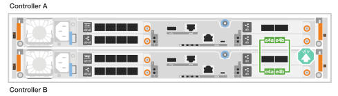
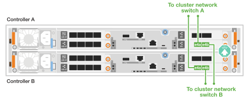

= Cable the hardware for the ASA A20, ASA A30, and ASA A50 storage systems
:icons: font
:imagesdir: ../media/

[.lead]
After you install the rack hardware for your ASA A20, ASA A30, or ASA A50 storage system, install the network cables for the controllers and connect the cables between the controllers and storage shelves.

.Before you begin

Contact your network administrator for information about connecting the storage system to your network switches.

.About this task
* These procedures show common configurations. The specific cabling depends on the components ordered for your storage system. For comprehensive configuration and slot priority details, see link:https://hwu.netapp.com[NetApp Hardware Universe^].

* The cabling graphics have arrow icons showing the proper orientation (up or down) of the cable connector pull-tab when inserting a connector into a port.
+
As you insert the connector, you should feel it click into place; if you do not feel it click, remove it, turn it over and try again.
+
image:../media/drw_cable_pull_tab_direction_ieops-1699.svg[Cable pull tab direction]

* If cabling to an optical switch, insert the optical transceiver into the controller port before cabling to the switch port.

== Step 1: Cable the cluster/HA connections

Cable the controllers to create the ONTAP cluster connections. For switchless clusters, connect the controllers to each other. For switched clusters, connect the controllers to the cluster network switches.

NOTE: The cluster interconnect traffic and the HA traffic share the same physical ports.

=== Switchless cluster cabling

Use this cabling option when the two controllers are directly connected to each other without using cluster network switches.

==== ASA A30 or ASA A50 with two 2-port 40/100 GbE I/O modules

Cable the cluster/HA interconnect ports on the I/O modules in slots 2 and 4.

.Steps

. Connect the Cluster/HA interconnect connections: 
+
NOTE: The cluster interconnect traffic and the HA traffic share the same physical ports (on the I/O modules in slots 2 and 4). The ports are 40/100 GbE. 
+
.. Connect controller A port e2a to controller B port e2a.
.. Connect controller A port e4a to controller B port e4a.
+
NOTE: I/O module ports e2b and e4b are unused and available for host network connectivity.
+
*100 GbE Cluster/HA interconnect cables*
+
image::../media/oie_cable100_gbe_qsfp28.png[Cluster HA 100 GbE cable,width=100px]
+
image::../media/drw_isi_a30-50_switchless_2p_100gbe_2card_cabling_ieops-2011.svg[Switchless cluster cabling diagram using two 100 GbE I/O modules]

==== ASA A30 or ASA A50 with one 2-port 40/100 GbE I/O module

Cable the cluster/HA interconnect ports on the I/O module in slot 4.

.Steps

. Connect the Cluster/HA interconnect connections: 
+
NOTE: The cluster interconnect traffic and the HA traffic share the same physical ports (on the I/O module in slot 4). The ports are 40/100 GbE.
+
.. Connect controller A port e4a to controller B port e4a.
.. Connect controller A port e4b to controller B port e4b.
+
*100 GbE Cluster/HA interconnect cables*
+
image::../media/oie_cable100_gbe_qsfp28.png[Cluster HA 100 GbE cable,width=100px]
+
image::../media/drw_isi_a30-50_switchless_2p_100gbe_1card_cabling_ieops-1925.svg[Switchless cluster cabling diagram using one 100 GbE I/O module]

==== ASA A20 with one 2-port 10/25 GbE I/O module

Cable the cluster/HA interconnect ports on the I/O module in slot 4.

.Steps

. Connect the Cluster/HA interconnect connections: 
+
NOTE: The cluster interconnect traffic and the HA traffic share the same physical ports (on the I/O module in slot 4). The ports are 10/25 GbE.
+
.. Connect controller A port e4a to controller B port e4a.
.. Connect controller A port e4b to controller B port e4b.
+
*25 GbE Cluster/HA interconnect cables*
+
image:../media/oie_cable_sfp_gbe_copper.png[GbE SFP copper connector,width=100px]
+

=== Switched cluster cabling

Use this cabling option when the controllers connect to cluster network switches instead of being directly connected to each other.

==== ASA A30 or ASA A50 with two 2-port 40/100 GbE I/O modules

Cable the cluster/HA interconnect ports on the I/O modules in slots 2 and 4 to the cluster network switches.

.Steps

. Cable the Cluster/HA interconnect connections: 
+
NOTE: The cluster interconnect traffic and the HA traffic share the same physical ports (on the I/O modules in slots 2 and 4). The ports are 40/100 GbE.
+
.. Connect controller A port e4a to cluster network switch A.
.. Connect controller A port e2a to cluster network switch B.
.. Connect controller B port e4a to cluster network switch A.
.. Connect controller B port e2a to cluster network switch B.
+
NOTE: I/O module ports e2b and e4b are unused and available for host network connectivity.
+
*40/100 GbE Cluster/HA interconnect cables*
+
image::../media/oie_cable100_gbe_qsfp28.png[Cluster HA 40/100 GbE cable,width=100px]
+
image::../media/drw_isi_a30-50_switched_2p_100gbe_2card_cabling_ieops-2013.svg[Switched cluster cabling diagram using two 100 GbE I/O modules]

==== ASA A30 or ASA A50 with one 2-port 40/100 GbE I/O module

Cable the cluster/HA interconnect ports on the I/O module in slot 4 to the cluster network switches.

.Steps

. Cable the controllers to the cluster network switches:
+
NOTE: The cluster interconnect traffic and the HA traffic share the same physical ports (on the I/O module in slot 4). The ports are 40/100 GbE.
+
.. Connect controller A port e4a to cluster network switch A. 
.. Connect controller A port e4b to cluster network switch B.
.. Connect controller B port e4a to cluster network switch A. 
.. Connect controller B port e4b to cluster network switch B.
+
*40/100 GbE Cluster/HA interconnect cables*
+
image::../media/oie_cable100_gbe_qsfp28.png[Cluster HA 40/100 GbE cable,width=100px]
+
image::../media/drw_isi_a30-50_2p_100gbe_1card_switched_cabling_ieops-1926.svg[Cable cluster connections to cluster network,width=500px]

==== ASA A20 with one 2-port 10/25 GbE I/O module

Cable the cluster/HA interconnect ports on the I/O module in slot 4 to the cluster network switches.

.Steps

. Cable the controllers to the cluster network switches:
+
NOTE: The cluster interconnect traffic and the HA traffic share the same physical ports (on the I/O module in slot 4). The ports are 10/25 GbE.
+
.. Connect controller A port e4a to cluster network switch A. 
.. Connect controller A port e4b to cluster network switch B.
.. Connect controller B port e4a to cluster network switch A. 
.. Connect controller B port e4b to cluster network switch B.
+
*10/25 GbE Cluster/HA interconnect cables*
+
image::../media/oie_cable_sfp_gbe_copper.png[GbE SFP copper connector,width=100px]
+

== Step 2: Cable the host network connections

Connect the Ethernet module ports or the Fibre Channel (FC) module ports to your host network.

=== Ethernet host cabling

Connect the controllers to your Ethernet host network using the appropriate ports based on your I/O module configuration.

==== ASA A30 or ASA A50 with two 2-port 40/100 GbE I/O modules

Use ports e2b and e4b on each controller to connect to the Ethernet host network switches.

On each controller, connect ports e2b and e4b to the Ethernet host network switches.

NOTE: The ports on I/O modules in slot 2 and 4 are 40/100 GbE (host connectivity is 40/100 GbE).

*40/100 GbE cables*

image::../media/oie_cable_sfp_gbe_copper.png[40/100 GbE cable,width=100px]

image::../media/drw_isi_a30-50_host_2p_40-100gbe_2card_cabling_ieops-2014.svg[Cable to 40/100 GbE Ethernet host network switches]

==== ASA A20, A30, or A50 with one 4-port 10/25 GbE I/O module

Use all four ports on the I/O module in slot 2 to connect to the Ethernet host network switches.

On each controller, connect ports e2a, e2b, e2c, and e2d to the Ethernet host network switches.

*10/25 GbE cables*

image:../media/oie_cable_sfp_gbe_copper.png[GbE SFP copper connector,width=100px]

image::../media/drw_isi_a30-50_host_2p_40-100gbe_1card_cabling_ieops-1923.svg[Cable to 10/25 GbE Ethernet host network switches]

=== FC host cabling

Connect the controllers to your Fibre Channel host network using the FC I/O module in your system.

==== ASA A20, A30, or A50 with one 4-port 64 Gb/s FC I/O module

Use all four ports on the FC I/O module in slot 2 to connect to the FC host network switches.

On each controller, connect ports 2a, 2b, 2c, and 2d to the FC host network switches.

*64 Gb/s FC cables*

image:../media/oie_cable_sfp_gbe_copper.png[64 Gb/s FC cable,width=100px]

image::../media/drw_isi_a30-50_4p_64gb_fc_1card_cabling_ieops-1924.svg[Cable to 64 Gb/s FC host network switches]

== Step 3: Cable the management network connections

Connect the controllers to your management network.

Connect the management (wrench) ports on each controller to the management network switches.

*1000BASE-T RJ-45 cables*

image::../media/oie_cable_rj45.png[RJ-45 cables,width=100px]

image::../media/drw_isi_g_wrench_cabling_ieops-1928.svg[Connect to your management network]

IMPORTANT: Do not plug in the power cords yet. 

== Step 4: Cable the shelf connections

The NS224 shelf cabling procedure shows NSM100B modules instead of NSM100 modules. The cabling is the same regardless of the type of NSM modules used, only the port names are different: 

* NSM100B modules use ports e1a and e1b on an I/O module in slot 1.
* NSM100 modules use built-in (onboard) ports e0a and e0b.

For the maximum number of shelves supported for your storage system and for all of your cabling options, such as optical and switch-attached, see link:https://hwu.netapp.com[NetApp Hardware Universe^].

Cable each controller to each NSM module on the NS224 shelf using the storage cables that came with your storage system.

*100 GbE QSFP28 copper cables*

image::../media/oie_cable100_gbe_qsfp28.png[100 GbE QSFP28 copper cable,width=100px]

The graphics show controller A cabling in blue and controller B cabling in yellow. 

.Steps

. Connect controller A to the shelf:
.. Connect controller A port e3a to NSM A port e1a.
.. Connect controller A port e3b to NSM B port e1b.
+
image:../media/drw_isi_g_1_ns224_controller_a_cabling_ieops-1945.svg[Controller A ports e3a and e3b cabled to one NS224 shelf]

. Connect controller B to the shelf:
.. Connect controller B port e3a to NSM B port e1a.
.. Connect controller B port e3b to NSM A port e1b.
+
image:../media/drw_isi_g_1_ns224_controller_b_cabling_ieops-1946.svg[Controller B ports e3a and e3b cabled to one NS224 shelf]

.What's next?

After you've connected the storage controllers to your network and then connected the controllers to your storage shelves, you link:power-on-hardware.html[power on the ASA r2 storage system].
