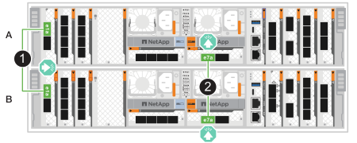
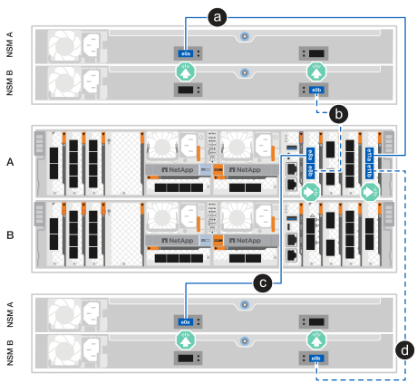

= Cable the hardware for the ASA A70 and ASA A90 storage systems
:icons: font
:imagesdir: ../media/

[.lead]
Connect the ASA A70 or ASA A90 storage system to your network and storage shelves to enable cluster communication, management access, and SAN host connectivity. This procedure includes cabling for cluster/HA interconnect, management network, host network, and storage shelf connections.

.Before you begin

Contact your network administrator for information about connecting the storage system to your network switches.

.About this task
* These procedures show common configurations. The specific cabling depends on the components ordered for your storage system. For comprehensive configuration and slot priority details, see link:https://hwu.netapp.com[NetApp Hardware Universe^].

* The I/O slots on the ASA A70 and ASA A90 are numbered 1 through 11.
+
image::../media/drw_a1K_back_slots_labeled_ieops-2162.svg[Slot numbering on an ASA A70 and ASA A90 controller]

* The cabling graphics have arrow icons showing the proper orientation (up or down) of the cable connector pull-tab when inserting a connector into a port.
+
As you insert the connector, you should feel it click into place; if you do not feel it click, remove it, turn it over and try again.
+
image:../media/drw_cable_pull_tab_direction_ieops-1699.svg[Cable pull tab direction]

* If cabling to an optical switch, insert the optical transceiver into the controller port before cabling to the switch port.

== Step 1: Cable the cluster/HA connections

Cable the controllers to create the ONTAP cluster connections. For switchless clusters, connect the controllers to each other. For switched clusters, connect the controllers to the cluster network switches.

NOTE: The cluster interconnect traffic and the HA traffic share the same physical ports.

[role="tabbed-block"]
=====
.Switchless cluster cabling
--
Use this cabling option when the two controllers are directly connected to each other without using cluster network switches.

Use the Cluster/HA interconnect cable to connect ports e1a to e1a and ports e7a to e7a.

.Steps

. Connect port e1a on Controller A to port e1a on Controller B.
. Connect port e7a on Controller A to port e7a on Controller B.
+
*Cluster/HA interconnect cables*
+
image::../media/oie_cable_25Gb_Ethernet_SFP28_IEOPS-1069.svg[Cluster HA cable,width=100px]
+

--

.Switched cluster cabling
--
Use this cabling option when the controllers connect to cluster network switches instead of being directly connected to each other.

Use the 100 GbE cable to connect ports e1a and e7a to the cluster network switches.

NOTE: Switched cluster configurations are supported in ONTAP 9.16.1 and later.

.Steps

. Connect port e1a on Controller A and port e1a on Controller B to cluster network switch A. 
. Connect port e7a on Controller A and port e7a on Controller B to cluster network switch B.
+
*100 GbE cable*
+
image::../media/oie_cable100_gbe_qsfp28.png[100 GbE cable,width=100px]
+
image::../media/drw_70-90_switched_cluster_cabling_ieops-1657.svg[Cable cluster connections to cluster network,width=500px]
--
=====

== Step 2: Cable the host network connections

Connect the Ethernet module ports to your host network. 

The following are some typical host network cabling examples. See link:https://hwu.netapp.com[NetApp Hardware Universe^] for your specific system configuration.

[role="tabbed-block"]
=====
.100 GbE host network
--
Connect ports e9a and e9b to your 100 GbE Ethernet data network switch.

NOTE: For maximum system performance for cluster and HA traffic, do not use ports e1b and e7b for host network connections. Use a separate host card to maximize performance.

.Steps

. Connect controller A port e9a and controller B port e9a to the Ethernet data network switch.
. Connect controller A port e9b and controller B port e9b to the Ethernet data network switch.
+
*100 GbE cable*
+
image::../media/oie_cable_sfp_gbe_copper.svg[100 GbE Ethernet cable,width=100px]
+
image::../media/drw_70-90_network_cabling1_ieops-1654.svg[Cable to 100 GbE Ethernet network,width=500px]
--

.10/25 GbE host network
--
Connect ports on your 10/25 GbE I/O module to your host network switches.

.Steps

. Connect the 10/25 GbE I/O module ports on each controller to the host network switches.
+
*10/25 GbE cable*
+
image::../media/oie_cable_sfp_gbe_copper.svg[10/25 GbE cable,width=100px]
+
image::../media/drw_70-90_network_cabling2_ieops-1655.svg[Cable to 10/25 GbE Ethernet network,width=500px]
--
=====

== Step 3: Cable the management network connections

Connect the controllers to your management network.

Use the 1000BASE-T RJ-45 cables to connect the management (wrench) ports on each controller to the management network switches.

.Steps

. Connect the management (wrench) port on controller A to management network switch.
. Connect the management (wrench) port on controller B to management network switch.
+
*1000BASE-T RJ-45 cables*
+

+
image::../media/drw_70-90_management_connection_ieops-1656.svg[Connect to your management network,width=500px]

IMPORTANT: Do not plug in the power cords yet. 

== Step 4: Cable the shelf connections

The ASA A70 and ASA A90 storage systems support NS224 shelves with either the NSM100 or NSM100B module. The major differences between the modules are:  

* NSM100 shelf modules use built-in ports e0a and e0b.
* NSM100B shelf modules use ports e1a and e1b in slot 1.

The following cabling examples show NSM100 modules in the NS224 shelves when referring to shelf module ports.

For the maximum number of shelves supported for your storage system and for all of your cabling options, such as optical and switch-attached, see link:https://hwu.netapp.com[NetApp Hardware Universe^].

[role="tabbed-block"]
=====
.One NS224 storage shelf
--
Use this cabling option when you have a single NS224 shelf.

Connect each controller to the NSM modules on the NS224 shelf. The graphics show cabling from each of the controllers: Controller A cabling is shown in blue and Controller B cabling is shown in yellow.

*100 GbE QSFP28 copper cables*

image::../media/oie_cable100_gbe_qsfp28.svg[100 GbE QSFP28 copper cable,width=100px]

.Steps

. Connect controller A port e11a to NSM A port e0a.
. Connect controller A port e11b to NSM B port e0b.
+
image:../media/drw_a70-90_1shelf_cabling_a_ieops-1731.svg[Controller A e11a and e11b to a single NS224 shelf]

. Connect controller B port e11a to NSM B port e0a.
. Connect controller B port e11b to NSM A port e0b.
+
image:../media/drw_a70-90_1shelf_cabling_b_ieops-1732.svg[Controller B e11a and e11b to a single NS224 shelf]
--

.Two NS224 storage shelves
--
Use this cabling option when you have two NS224 shelves.

Connect each controller to the NSM modules on both NS224 shelves. The graphics show cabling from each of the controllers: Controller A cabling is shown in blue and Controller B cabling is shown in yellow.

*100 GbE QSFP28 copper cables*

image::../media/oie_cable100_gbe_qsfp28.svg[100 GbE QSFP28 copper cable,width=100px]

.Steps

. On controller A, connect the following ports:
.. Connect port e11a to shelf 1 NSM A port e0a.
.. Connect port e11b to shelf 2 NSM B port e0b.
.. Connect port e8a to shelf 2 NSM A port e0a.
.. Connect port e8b to shelf 1 NSM B port e0b.
+

. On controller B, connect the following ports:
.. Connect port e11a to shelf 1 NSM B port e0a.
.. Connect port e11b to shelf 2 NSM A port e0b.
.. Connect port e8a to shelf 2 NSM B port e0a.
.. Connect port e8b to shelf 1 NSM A port e0b.
+
image:../media/drw_a70-90_2shelf_cabling_b_ieops-1734.svg[Controller-to-shelf connections for controller B]
--
=====

.What's next?

After you've connected the storage controllers to your network and then connected the controllers to your storage shelves, you link:power-on-hardware.html[power on the ASA r2 storage system].
