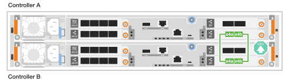

= Cable the hardware for your ASA r2 storage system
:icons: font
:imagesdir: ../media/

[.lead]
After you install the rack hardware for your ASA r2 storage system, install the network cables for the controllers, and connect the cables between the controllers and storage shelves.

.Before you begin

Contact your network administrator for information about connecting the storage system to your network switches.

.About this task
* These procedures show common configurations. The specific cabling depends on the components ordered for your storage system. For comprehensive configuration and slot priority details, see link:https://hwu.netapp.com[NetApp Hardware Universe^].

* The cabling graphics have arrow icons showing the proper orientation (up or down) of the cable connector pull-tab when inserting a connector into a port.
+
As you insert the connector, you should feel it click into place; if you do not feel it click, remove it, turn it over and try again.
+
image:../media/drw_cable_pull_tab_direction_ieops-1699.svg[Cable pull tab direction]

* If cabling to an optical switch, insert the optical transceiver into the controller port before cabling to the switch port.

== Step 1: Cable the cluster/HA connections
Cable the controllers to your ONTAP cluster. This procedure differs depending on your storage system model and I/O module configuration.

//open tabbed block 
[role="tabbed-block"]
=====
.A1K
--
Use the Cluster/HA interconnect cable to connect ports e1a to e1a and ports e7a to e7a.

NOTE: The cluster interconnect traffic and the HA traffic share the same physical ports.

.Steps

. Connect port e1a on Controller A to port e1A on Controller B.
. Connect port e7a on Controller A to port e1A on Controller B.
+
*Cluster/HA interconnect cables*
+
image::../media/oie_cable_25Gb_Ethernet_SFP28_IEOPS-1069.svg[Cluster HA cable,width=100pxx]
+
image::../media/drw_a1k_tnsc_cluster_cabling_ieops-1648.svg[Two-node switchless cluster cabling diagram,width=500px]
+

--
.A70 and A90
--
Use the the Cluster/HA interconnect cable to connect to connect ports e1a to e1a and ports e7a to e7a.

NOTE: The cluster interconnect traffic and the HA traffic share the same physical ports.

.Steps

. Connect port e1a on Controller A to port e1A on Controller B.
. Connect port e7a on Controller A to port e1A on Controller B.
+
*Cluster/HA interconnect cables*
+
image::../media/oie_cable_25Gb_Ethernet_SFP28_IEOPS-1069.svg[Cluster HA cable, width=100pxx]

+
image::../media/drw_70-90_tnsc_cluster_cabling_ieops-1653.svg[Two-node switchless cluster cabling diagram, width=500px]
+

--

.A20, A30, and A50
--
Connect the controllers to each other to create the ONTAP cluster connections.

.ASA A30 and ASA A50 with two 2-port 40/100 GbE I/O modules
[%collapsible]
====

.Steps

. Connect the Cluster/HA interconnect connections: 
+
NOTE: The cluster interconnect traffic and the HA traffic share the same physical ports (on the I/O modules in slots 2 and 4). The ports are 40/100 GbE. 
+
.. Connect controller A port e2a to controller B port e2a.
.. Connect controller A port e4a to controller B port e4a.
+
NOTE: I/O module ports e2b and e4b are unused and available for host network connectivity.
+
*100 GbE Cluster/HA interconnect cables*
+
image::../media/oie_cable100_gbe_qsfp28.png[Cluster HA 100 GbE cable, width=100pxx]
+
image::../media/drw_isi_a30-50_switchless_2p_100gbe_2card_cabling_ieops-2011.svg[a30 and a50 switchless cluster cabling diagram using two 100gbe io modules]

====

.ASA A30 and ASA A50 with one 2-port 40/100 GbE I/O module
[%collapsible]

====

.Steps

. Connect the Cluster/HA interconnect connections: 
+
NOTE: The cluster interconnect traffic and the HA traffic share the same physical ports (on the I/O module in slot 4). The ports are 40/100 GbE.
+
.. Connect controller A port e4a to controller B port e4a.
.. Connect controller A port e4b to controller B port e4b.
+
*100 GbE Cluster/HA interconnect cables*
+
image::../media/oie_cable100_gbe_qsfp28.png[Cluster HA 100 GbE cable, width=100pxx]
+
image::../media/drw_isi_a30-50_switchless_2p_100gbe_1card_cabling_ieops-1925.svg[a30 and a50 switchless cluster cabling diagram using one 100gbe io module]

====

.ASA A20 with one 2-port 10/25 GbE I/O module
[%collapsible]

====

.Steps
. Connect the Cluster/HA interconnect connections: 
+
NOTE: The cluster interconnect traffic and the HA traffic share the same physical ports (on the I/O module in slot 4). The ports are 10/25 GbE.
+
.. Connect controller A port e4a to controller B port e4a.
.. Connect controller A port e4b to controller B port e4b.
+
*25 GbE Cluster/HA interconnect cables*
+
image:../media/oie_cable_sfp_gbe_copper.png[GbE SFP copper connector, width=100px]
+

====

--
===== 
//closed tabbed block 

== Step 2: Cable the host network connections
Connect the controllers to your host network. 

This procedure differs depending on your storage system model and I/O module configuration.

// start tabbed area

[role="tabbed-block"]
=====

.A1K
--
Connect the Ethernet module ports to your host network. 

The following are some typical host network cabling examples. See  link:https://hwu.netapp.com[NetApp Hardware Universe^] for your specific system configuration.

.Steps

. Connect ports e9a and e9b to your Ethernet data network switch.
+
NOTE: For maximum system performance for cluster and HA traffic, do not use ports e1b and e7b ports for host network connections.  Use a separate host card to maximize performance.

+
*100 GbE cable*
+
image::../media/oie_cable_sfp_gbe_copper.svg[100Gb Ethernet cable,width=100px]
+
image::../media/drw_a1k_network_cabling1_ieops-1649.svg[Cable to 100Gb Ethernet network,width=500px]

+
. Connect your 10/25 GbE host network switches.
+
*10/25 GbE Host*
+
image::../media/oie_cable_sfp_gbe_copper.svg[10/25Gb Ethernet cable,width=100px]
+
image::../media/drw_a1k_network_cabling2_ieops-1650.svg[Cable to 10/25Gb Ethernet network,width=500px]
--

.A70 and A90
--
Connect the Ethernet module ports to your host network. 

The following are some typical host network cabling examples. See  link:https://hwu.netapp.com[NetApp Hardware Universe^] for your specific system configuration.

.Steps
. Connect ports e9a and e9b to your Ethernet data network switch.
+
NOTE: For maximum system performance for cluster and HA traffic, do not use ports e1b and e7b ports for host network connections.  Use a separate host card to maximize performance.

+
*100 GbE cable*
+
image::../media/oie_cable_sfp_gbe_copper.svg[100Gb Ethernet cable, width=100px]
+
image::../media/drw_70-90_network_cabling1_ieops-1654.svg[Cable to 100 Gb Ethernet network,width=500px]

+
. Connect your 10/25 GbE host network switches.
+
*4-ports, 10/25 GbE Host*
+
image::../media/oie_cable_sfp_gbe_copper.svg[10/25 Gb cable,width=100px]
+
image::../media/drw_70-90_network_cabling2_ieops-1655.svg[Cable to 100Gb Ethernet network,width=500px]
--

.A20, A30, and A50
--
Connect the Ethernet module ports or the Fibre Channel (FC) module ports to your host network.

*Ethernet host cabling*

.ASA A30 and ASA A50: Two 2-port 40/100 GbE I/O modules
[%collapsible]

====

On each controller, connect ports e2b and e4b to the Ethernet host network switches.

NOTE: The ports on I/O modules in slot 2 and 4 are 40/100 GbE (host connectivity is 40/100 GbE).

*40/100 GbE cables*

image::../media/oie_cable_sfp_gbe_copper.png[40/100 Gb cable, width=100px]

image::../media/drw_isi_a30-50_host_2p_40-100gbe_2card_cabling_ieops-2014.svg[Cable to 40/100gbe ethernet host network switches]

====

.ASA A20, A30, and A50: One 4-port 10/25 GbE I/O module
[%collapsible]

====

On each controller, connect ports e2a, e2b, e2c and e2d to the Ethernet host network switches.

*10/25 GbE cables*

image:../media/oie_cable_sfp_gbe_copper.png[GbE SFP copper connector, width=100px]

image::../media/drw_isi_a30-50_host_2p_40-100gbe_1card_cabling_ieops-1923.svg[Cable to 40/100gbe ethernet host network switches]
====

*FC host cabling*

.ASA A20, A30, and A50: One 4-port 64 Gb/s FC I/O module
[%collapsible]

====

On each controller, connect ports 1a, 1b, 1c and 1d  to the FC host network switches.

*64 Gb/s FC cables*

image:../media/oie_cable_sfp_gbe_copper.png[64 Gb fc cable,width=100px]

image::../media/drw_isi_a30-50_4p_64gb_fc_1card_cabling_ieops-1924.svg[Cable to 64gb fc host network switches]

====

--

=====

// end tabbed area

== Step 3: Cable the management network connections
Connect the controllers to your management network.

Contact your network administrator for information about connecting your storage system to the management network switches.

// start tabbed area

[role="tabbed-block"]
====

.A1K
--
Use the 1000BASE-T RJ-45 cables to connect the management (wrench) ports on each controller to the management network switches.

image::../media/oie_cable_rj45.svg[RJ-45 cables,width=100px]
*1000BASE-T RJ-45 cables*

image::../media/drw_a1k_management_connection_ieops-1651.svg[Connect to your management network,width=500px]

IMPORTANT: Do not plug in the power cords yet. 
--

.A70 and A90
--
Use the 1000BASE-T RJ-45 cables to connect the management (wrench) ports on each controller to the management network switches.

image::../media/oie_cable_rj45.svg[RJ45 cables,width=100px]
*1000BASE-T RJ-45 cables*

image::../media/drw_70-90_management_connection_ieops-1656.svg[Connect to your management network,width=500px]

IMPORTANT: Do not plug in the power cords yet. 
--

.A20, A30, and A50
--
Connect the management (wrench) ports on each controller to the management network switches.

*1000BASE-T RJ-45 cables*

image::../media/oie_cable_rj45.png[RJ-45 cables]

image::../media/drw_isi_g_wrench_cabling_ieops-1928.svg[Connect to your management network]

IMPORTANT: Do not plug in the power cords yet. 

--

====

// end tabbed area

== Step 4: Cable the shelf connections

The following cabling procedures show how to connect your controllers to a storage shelf.

For the maximum number of shelves supported for your storage system and for all of your cabling options, see link:https://hwu.netapp.com[NetApp Hardware Universe^].

//open tabbed block 

[role="tabbed-block"]
====

.A1K
--
Choose one of the following cabling options that matches your setup.

// Start snippet: collapsible block (open on page load)
.Option 1: Connect the controllers to one NS224 storage shelf
[%collapsible]
=====

Connect each controller to the NSM modules on the NS224 shelf. The graphics show cabling from each of the controllers: Controller A cabling is shown in blue and Controller B cabling is shown in yellow.

.Steps

. On controller A, connect the following ports:
.. Connect port e11a to NSM A port e0a.
.. Connect port e11b to port NSM B port e0b.
+
image:../media/drw_a1k_1shelf_cabling_a_ieops-1703.svg[Controller A e11a and e11b to a single NS224 shelf]

. On controller B, connect the following ports:
.. Connect port e11a to NSM B port e0a.
.. Connect port e11b to NSM A port e0b.
+
image:../media/drw_a1k_1shelf_cabling_b_ieops-1704.svg[Cable controller B ports e11a and e11b to a single NS224 shelf]

=====
// End snippet

// Start snippet: collapsible block (open on page load)
.Option 2: Connect the controllers to two NS224 storage shelves
[%collapsible]
=====
Connect each controller to the NSM modules on both NS224 shelves. The graphics show cabling from each of the controllers: Controller A cabling is shown in blue and Controller B cabling is shown in yellow.

.Steps

. On controller A, connect the following ports:
.. Connect port e11a to shelf 1 NSM A port e0a.

.. Connect port e11b to shelf 2 NSM B port e0b.

.. Connect port e10a to shelf 2 NSM A port e0a.

.. Connect port e10b to shelf 1 NSM A port e0b.
+
image:../media/drw_a1k_2shelf_cabling_a_ieops-1705.svg[Controller-to-shelf connections for controller A]
+

. On controller B, connect the following ports:
.. Connect port e11a to shelf 1 NSM B port e0a.

.. Connect port e11b to shelf 2 NSM A port e0b.

.. Connect port e10a to shelf 2 NSM B port e0a.

.. Connect port e10b to shelf 1 NSM A port e0b.
+
image:../media/drw_a1k_2shelf_cabling_b_ieops-1706.svg[Controller-to-shelf connections for controller B]

=====
// End snippet

--
.A70 and A90
--
Choose one of the following cabling options that matches your setup.

// Start snippet: collapsible block (open on page load)
.Option 1: Connect the controllers to one NS224 storage shelf
[%collapsible]
=====

Connect each controller to the NSM modules on the NS224 shelf. The graphics show cabling from each of the controllers: Controller A cabling is shown in blue and Controller B cabling is shown in yellow.

*100 GbE QSFP28 copper cables*

image::../media/oie_cable100_gbe_qsfp28.svg[100 GbE QSFP28 copper cable,width=100px]

.Steps
. Connect controller A port e11a to NSM A port e0a.
. Connect controller A port e11b to port NSM B port e0b.
+
image:../media/drw_a70-90_1shelf_cabling_a_ieops-1731.svg[Controller A e11a and e11b to a single NS224 shelf]

. Connect controller B port e11a to NSM B port e0a.
. Connect controller B port e11b to NSM A port e0b.
+
image:../media/drw_a70-90_1shelf_cabling_b_ieops-1732.svg[Controller B e11a and e11b to a single NS224 shelf]

=====
// End snippet

// Start snippet: collapsible block (open on page load)
.Option 2: Connect the controllers to two NS224 storage shelves
[%collapsible]
=====
Connect each controller to the NSM modules on both NS224 shelves. The graphics show cabling from each of the controllers: Controller A cabling is shown in blue and Controller B cabling is shown in yellow.

*100 GbE QSFP28 copper cables*

image::../media/oie_cable100_gbe_qsfp28.svg[100 GbE QSFP28 copper cable,width=100px]

.Steps

. On on controller A, connect the following ports:
.. Connect port e11a to shelf 1, NSM A port e0a.

.. Connect port e11b to shelf 2, NSM B port e0b.

.. Connect port e8a to shelf 2, NSM A port e0a.

.. Connect port e8b to shelf 1, NSM B port e0b.
+
image:../media/drw_a70-90_2shelf_cabling_a_ieops-1733.svg[Controller-to-shelf connections for controller A]
+

. On controller B, connect the following ports:
.. Connect port e11a to shelf 1, NSM B port e0a.

.. Connect  port e11b to shelf 2, NSM A port e0b.

.. Connect port e8a to shelf 2, NSM B port e0a.

.. Connect port e8b to shelf 1, NSM A port e0b.
+
image:../media/drw_a70-90_2shelf_cabling_b_ieops-1734.svg[Controller-to-shelf connections for controller B]
=====
// End snippet

--
.A20, A30, and A50
--
Connect each controller to its corresponding NSM100B module on the NS224 shelf using the storage cables provided with your storage system; these may include the following cable type:

*100 GbE QSFP28 copper cables*

image::../media/oie_cable100_gbe_qsfp28.png[100 GbE QSFP28 copper cable,width=100px]

The graphics show controller A cabling in blue and controller B cabling in yellow. 

.Steps

. Connect controller A to the shelf:
.. connect controller A port e3a to NSM A port e1a.
.. Connect controller A port e3b to NSM B port e1b.
+
image:../media/drw_isi_g_1_ns224_controller_a_cabling_ieops-1945.svg[Controller A ports e3a and e3b cabled to one NS224 shelf]

. Connect controller B to the shelf:
.. Connect controller B port e3a to NSM B port e1a.
.. Connect controller B port e3b to NSM A port e1b.
+
image:../media/drw_isi_g_1_ns224_controller_b_cabling_ieops-1946.svg[Controller B ports e3a and e3b cabled to one NS224 shelf]
--

====

// end tabbed area

.What's next?
After you've connected the storage controllers to your network and then connected the controllers to your storage shelves, you link:power-on-hardware.html[power on the ASA r2 storage system].

// 2024 Sept 23, ONTAPDOC 1922