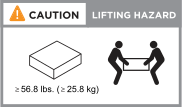

= Installation requirements for ASA r2 storage systems
:icons: font
:imagesdir: ../media/

[.lead]
Review the equipment needed and the lifting precautions for your ASA r2 storage system and storage shelves. 

== Equipment needed for install
To install your ASA r2 storage system, you need the following equipment and tools. 

** Access to a Web browser to configure your storage system
** Electrostatic discharge (ESD) strap 
** Flashlight
** Laptop or console with a USB/serial connection
** Paperclip or narrow tipped ball point pen for setting storage shelf IDs
** Phillips #2 screwdriver 

== Lifting precautions 
ASA r2 storage systems and storage shelves are heavy. Exercise caution when lifting and moving these items.

=== Storage system weights
Take the necessary precautions when moving or lifting your ASA r2 storage system.

[role="tabbed-block"]
====

.A1K
--

An ASA A1K storage system can weigh up to 62.83 lbs (28.5 kg). To lift the storage system, use two people or a hydraulic lift.

image::../media/drw_a1k_weight_caution_ieops-1698.svg[ASA A1K lifting caution icon]

--
.A70 and A90
--

An ASA A70 or ASA A90 storage system can weigh up to 151.68 lbs (68.8 kg). To lift the storage system, use four people or a hydraulic lift.

image::../media/drw_a70-90_weight_icon_ieops-1730.svg[ASA A90, ASA A70 weight caution icon]

--
.A20, A30, and A50
--

An ASA A20, ASA A30, or ASA A50 storage system can weigh up to 61.5 lbs (27.9 kg). To lift the storage system, use two people or a hydraulic lift.

image::../media/drw_g_lifting_weight_ieops-1831.svg[ASA A20, A30, or an A50 weight caution icon]
--

.C30
--

An ASA C30 storage system can weigh up to 61.5 lbs (27.9 kg). To lift the storage system, use two people or a hydraulic lift.

image::../media/drw_g_lifting_weight_ieops-1831.svg[ASA A20, A30, or an A50 weight caution icon]
--

====

=== Storage shelf weights
Take the necessary precautions when moving or lifting your shelf.

[role="tabbed-block"]
====

.NS224 shelf
--

An NS224 shelf can weigh up to 66.78 lbs (30.29 kg). To lift the shelf, use two people or a hydraulic lift. Keep all components in the shelf (both front and rear) to prevent unbalancing the shelf weight.

image::../media/drw_ns224_lifting_weight_ieops-1716.svg[NS224 NSM100 lifting caution]

--
.NS224 shelf with NSM100B modules
--
An NS224 shelf with NSM100B modules can weigh up to 56.8 lbs (25.8 kg). To lift the shelf, use two people or a hydraulic lift. Keep all components in the shelf (both front and rear) to prevent unbalancing the shelf weight.

--

====

.Related information

*  https://library.netapp.com/ecm/ecm_download_file/ECMP12475945[Safety information and regulatory notices^]

.What's next?
After you've reviewed the hardware requirements, you link:prepare-hardware.html[prepare to install your ASA r2 storage system].

// 2024 Sept 23, ONTAPDOC 1922
